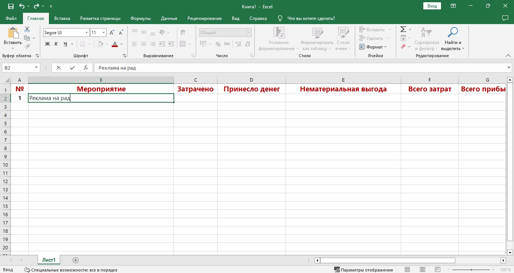
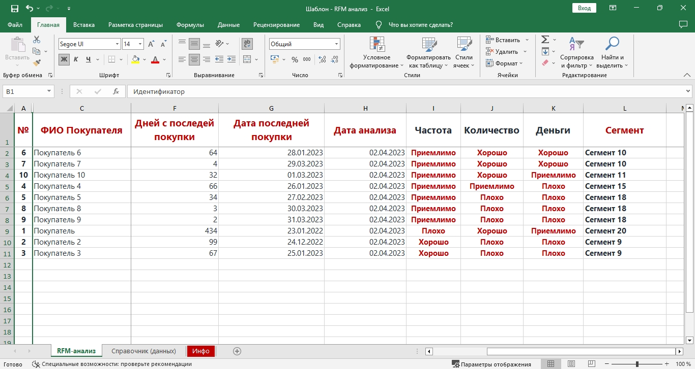
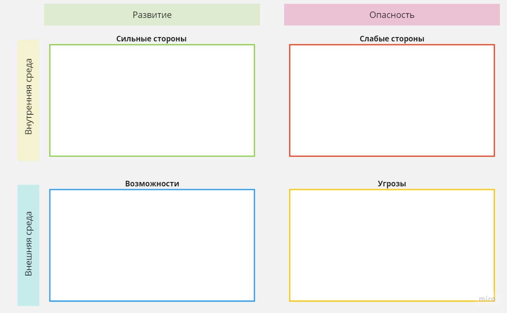

# Построение системного маркетинга - пошаговое руководство

[[toc]]

## Предварительная работа

Первым делом проверим успешного текущего курса, для этого сделаем следующие шаги.

1. Составьте список всех мероприятий по продвижению своего бизнеса, которые вы проводили в течении года:
    1. Проставьте статью расходов на каждый из них
    2. Проставьте принесённую выгоду для каждой из них, не обязательно в денежном эквиваленте — узнаваемость компании это тоже выгода!
    3. Выделите те из них, которые на Ваш взгляд были наиболее успешными
2. Зафиксируйте ориентировочный бюджет затраченный на мероприятия по продвижению
3. Зафиксируйте прибыль полученную в течении года
    1. Посчитайте коэффициент окупаемости (Пункт 3 - Пункт 2) / Пункт 2

Таким образом мы получим срез картины что имеется на данный момент.

Определимся, кто Ваш клиент? Хотя это больше тема раздела [Анализ целевой аудитории](/System/system-marketing), всё же для начала следует определить кому мы продаём товар:
- Организациям и индивидуальным предпринимателям
- Государственным организациям
- Обычным людям (Потребительский рынок)

По сути это 3 разных рынка, у каждого из которых есть особенности построения стратегии и свои наиболее эффективные методы продаж. <u>Здесь мы будем рассматривать работу с Потребительским рынком.</u>

## Сегментация рынка

Если Вы уже работаете несколько лет, наверняка у вас есть клиентская база. Если нет — пропустите следующий подраздел.

### Сегментирование клиентской базы

Один из самых распространенных методов сегментирования клиентской базы — RFM-анализ. RFM-анализ появился из принципа Парето, который гласит, что 80% прибыли приносит 20% клиентов; RFM-анализ помогает выявить эти 20%.

- <strong>R</strong>ecency — давность — последней покупки
- <strong>F</strong>requency — частота — покупок
- <strong>M</strong>onetary — сумма затрат — отображает количество принесённой клиентом прибыли

Определим критерии оценки, в моём примере будет так:

| Критерий | Показатель             |    Оценка |
|----------|:----------------------:|----------:|
| Давность | Меньше 50 дней назад   |    Хорошо |
| Давность | Меньше 100 дней назад  | Приемлемо |
| Давность | Больше 100 дней  назад |     Плохо |
    
| Критерий | Показатель         |    Оценка |
|----------|:------------------:|----------:|
| Частота  | Меньше 50 покупок  |     Плохо |
| Частота  | Меньше 150 покупок | Приемлемо |
| Частота  | Больше 150 покупок |    Хорошо |

| Критерий | Показатель     |    Оценка |
|----------|:--------------:|----------:|
| Затраты  | От 100 000     |    Хорошо |
| Затраты  | Меньше 100 000 | Приемлемо |
| Затраты  | Меньше 10 000  |     Плохо |

    

В зависимости от нормальной частоты покупки ваших товаров оценка разумеется будет иметь другие критерии.

Я предлагаю следующий алгоритм действий:
1. Выгружаем пользователей, дату их последней покупки, количество покупок, общую сумму покупок
2. Выполняем оценку критериев согласно выбранным показателям
3. Сегментируем покупателей 
4. Олицетворяем сегменты

В зависимости от комбинации оценок R (Давность) F (Частота)  M (Затраты), я предлагаю сделать следующую сегментацию:

| Комбинация (Давность,Частота,Затраты) | Характеристика                                                                           |
|---------------------------------------|:----------------------------------------------------------------------------------------:|
| Хорошо, Хорошо, Хорошо                  | Это лучший сегмент. Они приносят основную прибыль. Покупают часто и тратят много         |
| \*, Хорошо, \*                          | Лояльные клиенты, тратят не много, зато регулярно                                        |
| \*, \*, Хорошо                          | Тратят большие суммы, но редко. Не первый случай, но тоже очень важный сегмент           |
| Хорошо, Плохо, *                      | Чаще всего новые клиенты, из них могут вырасти лояльные клиенты, или даже лидеры покупок |
| Плохо, Плохо, *                       | Сегмент который вероятно был активным, но покупать стали плохо                           |
| Плохо, Плохо, Плохо                   | Сегмент напрочь убывших покупателей, они попросту перестали покупать                     |

Вообще говоря, выделить можно 27 сегментов, но вышеотмеченные для нас наиболее интересны.

Если интернет-магазин или торговая точка многопрофильная, то сегменты можно "обозвать" по группам товаров, которые люди из сегмента часто покупают — например «Кухонная утварь».

Следующим шагом следует установить почему люди из "Убывших" сегментов перестают покупать. 

Пообщаться лично с каждым из 10 000 покупателей задача не тривиальная, но если приоритетных сегментов окажется порядка 2-3, в каждом по 100 человек — то задача вполне выполнимая, к тому же можно общаться не с каждым, а например с каждым 10-тым.

Поинтересуйтесь почему они перестали у вас покупать, и почему покупали раньше? Ответы на эти вопросы позволят найти решение по удержанию клиентов. А ведь по известной статистике 80% прибыли приносят постоянные клиенты!

[Скачать шаблон RFM-анализа](https://mcprofit.biz/files/markeing-pattern--rfm-analyse.xlsx)

### Олицетворение сегментов

Полученные сегменты во первых можно дополнительно сегментировать, а во вторых нужно олицетворить — понять что за люди стоят за этими цифрами, сделать это можно по  разным критериям, вот к примеру:

1. Демографические характеристики: возраст, пол, доход, место проживания, образование.
2. Поведенческие факторы: частота покупок, объем заказов, предпочтения по брендам и цветам.
3. Географические факторы: географическое расположение и зоны доставки.
4. Технологические характеристики: использование мобильных приложений, социальных сетей и т.д.
5. Психографические характеристики: стиль жизни, ценности, интересы, демографические образы.

### Анализ рынка с помощью интернета

В настоящее время, в связи с санкционым беспределом результаты анализа через интернет могут быть в большей степени недостоверны, чем до 2022 года. Однако такое исследование всё ещё полезно, особенно если клиентской базы нет.

Критерии для исследования

- Сезонность
- Спрос
- Геолокация
- Количество предложений
- Демография посетителей
- Источники трафика
- Количество посещений

Для исследования сезонности можно использовать:

- [yandex wordstat](https://wordstat.yandex.by)
- [google trends](https://trends.google.ru)

<strong>Будьте осторожны, сезонность запросов не на 100% совпадает с реальным спросом!</strong>

## Анализ конкурентов

Анализ конкурентов процесс который никогда не заканчивается, заниматься им нужно всегда и всем сотрудникам.

> Посещайте успешные магазины и наблюдайте за их работой. Проанализируйте их сильные и слабые стороны. Делайте покупки у своих конкурентов
>  
>
> **Нэнси Глейзер, консультант по деловой стратегии**

Всех конкурентов условно можно разделить на 3 группы: 

1. <strong>Прямые</strong> — конкуренты с которыми у вас общая Целевая Аудитория и "весовая категория" (размер, финансовые возможности, и т.д.) и одинаковый товар
2. <strong>Косвенные</strong> — целевая аудитория общая, необязательно одинаковая "весовая категория", и разный товар — но они так же претендуют на деньги ваших клиентов
3. <strong>Зарубежные</strong> — конкуренты которые не работают на вашем рынке. Если зарубежный интернет-магазин осуществляет доставку в ваш регион и локализован под ваш язык — следует его отнести к косвенным.

Наибольшее внимание следует уделять прямым конкурентам, далее косвенным, но и про зарубежных нельзя забывать — зачастую у таких компаний можно подсмотреть что-то новое: маркетинговые механики, фишки на сайте или особенности приложения.

Наиболее опасными являются конкуренты с существенными финансовыми ресурсами, высокомотивированными или творческими сотрудниками — это правило работает во всех направлениях, ведь для ваших конкурентов Вы являетесь конкурентом.

Где брать конкурентов? Некоторых, Вы уже наверняка знаете, в каждом регионе найдётся как минимум 1 или 2 крупные компании занимающиеся интернет-торговлей. Остальных можно постепенно найти:

- Через поисковые системы: yandex, google, rambler
- В социальных сетях
- В каталогах
- На оффлайн рекламных щитах
- Узнавать о конкурентах у покупателей
- На маркет-плейсах и агрегаторах

Составьте список конкурентов, разбив по категориям. Определите кто из них Ваши главные конкуренты? Их следует анализировать с особенной тщательностью.

Составьте таблицу с критериями, по которым будете анализировать конкурентов или воспользуйтесь [нашим шаблоном](https://mcprofit.biz/files/marketing_pattern--competitors-analysis.xlsx).

На что следует обращать внимание при анализе конкурентов?

- Позиционирование и УТП
- Продуктовая матрица
  - Какой ассортимент предлагают
  - Ценовая политика: какие цены устанавливаются, как часто меняются
  - Вариативность товара
  - Качество, долговечность/поддержка/сервисное обслуживание
- Связь с другими компаниями: возможно компания является частью сети, холдинга или имеет партнёров
- Присутствие в рейтингах и торговых ассоциациях
- Маркетинг и реклама
  - Популярность бренда торговой компании
  - Насколько популярные бренды продают
  - Оффлайн реклама
  - Акции и розыгрыши
  - Следуют ли трендам, каким?
  - Как часто появляются в инфополе, где и в каком контексте?
- E-mail маркетинг или автоворонки в мессенджерах
- Источники трафика на сайт и количество посещений
- Являются ли официальными дистрибьютерами или импортёрами
- Оцените количество заказов. Сделать это довольно не хитро: оформите заказ в интернет-магазине конкурента в начале месяца, для наибольшей точности 1 числа в 00:00, выждите окончание месяца и ровно 1 числа в 00:00 следующего месяца снова оформите заказ. В 99% случае в теле письма есть номер заказа, отняв от второго первый вы узнаете количество заказов за месяц.
- Используйте тайного покупателя

Проанализируйте сайт конкурента:

- Удобство навигации, как работает поиск по каталогу
- Вовлечение и типы контента
 - Текстовый: обзоры, инструкции, рекомендации, отзывы
 - Графический: какое качество фотографий, в каких ракурсах и состояниях находиться товар
 - Видео: обзоры, обучение, инструкции, трюки
- Способы оплаты и доставки (где расположены, удобны ли)
- Интегрирован ли с маркет-плейсами и каталогами

Подумайте, в чём ваши конкурентные преимущества.

### Обобщение

1. Изучение сайтов конкурентов: Ознакомьтесь с продуктами или услугами, которые предлагают ваши конкуренты, изучите их цены и маркетинговые стратегии.
2. Анализ SEO-данных: Оцените топ-запросы, на которые оптимизируются страницы конкурентов, оцените трафик на их сайтах и другие метрики.
3. Следите за социальными сетями конкурентов: Получайте информацию об их промо-акциях, рекламе и общении с клиентами на страницах социальных сетей.
4. Изучение отзывов клиентов: Оцените мнения клиентов об услугах и продуктах конкурентов.
5. Анализ рекламных кампаний: Изучите рекламные объявления конкурентов и отслеживайте их результативность.

## SWOT анализ компании

Английская абревиатура SWOT расшифровывается как:

- <strong>S</strong>trengths — сильные стороны
- <strong>W</strong>eaknesses — слабые стороны
- <strong>O</strong>pportunities — возможности
- <strong>T</strong>hreats — угрозы

Для проведения SWOT-анализа заполняется таблица, по итогу делаются выводы.

SWOT-анализ позволяет держать пред глазами реальные угрозы для бизнеса и возможности для роста, что очень важно при составлении маркетинговой стратегии.

## Анализ целевой аудитории

> Имеется несколько способов классификации потребителей в зависимости от уровня доходов или стиля жизни. По уровню доходов потребители могут принадлежать к одной или нескольким категориям: 
> - Высокий,
> - Средний,
> - Ограниченный.
>
> Оценки по стилю жизни носят более субъективный характер. Поведение целевого потребителя зависит не столько от его доходов, сколько от того, как он использует имеющийся доход.
>
> **Нэнси Глейзер**, консультант по деловой стратегии

Критерии для сегментации и классификации целевой аудитории.

- Социально-демографическая
  - Возраст
  - Пол
  - Поколение
  - Семейное положение
  - Дети
  - Национальность
  - Религия
  - Род занятий и кем работает
  - Уровень дохода
  - Образование
- Географическая
  - Регион, область, город
  - Климат
  - Уровень развития (столица, областной, агро, сельский)
- Психографическая
  - Мотивация приобретения (выделится, следовать тренду, самоутвердиться)
  - Ценности (саморазвитие, экология, хобби, семья, признание, положение в обществе, статусность)
  - Жизненная позиция (активная или пассивная)
  - Принятие новшеств (консерватор, новатор, традиционалист)
  - Авторитеты
  - Интересы
- Поведенческая
  - Повод для покупки (бытовой или особенный случай)
  - Как часто покупают
  - С какой периодичностью покупают
  - Сколько покупают
  - Мотивация купить снова
  - Сколько времени требуется на принятие решения о покупке
  - Где узнал о товаре
  - Как использует товар
  - Предпочтительный способ оплаты
  - Выгоды от покупки ( качество, сервис, экономия )
  - Периодичность приобретения и использования
  - Необходимость или желание
  - Где обычно приобретают
  - Место потребления
  - На каком этапе принятия решения находятся

Оцените степень важности критериев выбора (не важно, важно, желательно)
- Цена
- Качество
- Торговая марка
- Продавец
- Распродажи, акции, программы лояльности
- Реклама
- Оформление магазина
- Упаковка
- Сервис
- Условия возврата
- Кредиты и рассрочки
- Гарантийное обслуживание

Если у Вас есть клиентская база и Вы выполнили сегментирования рынка — базовые сегменты у вас уже есть, теперь по каждому из сегментов нужно заполнить вышеприведённые критерии, естественно исключите не актуальные для Вашего случая.

Далее для каждого сегмента нужно составить портрет типового представителя — вымышленный персонаж. Запишите как проходит день персонажа, с какими задачами он сталкивается, какие трудности встречает (акцент разумеется на случаях с применением вашего товарного ассортимента), в каких местах бывает.

Где брать информацию?

- Наблюдайте за клиентами
- Проведите глубинное интервью на фокус-группе
- Проследите за тем что читают, смотрят ваши покупатели
- Какую рекламу используют Ваши конкуренты? Что она вещает?

## Путь клиента

Джон Янч, в своей книге «Продавец нового времени», приводит замечательный инструмент — «Песочные часы маркетинга».
Хотя сейчас модно составлять различные CJM (карты пути клиента), я предлагаю более лаконичный вариант. Основываться будем на «Лестнице Бена Ханта» и оригинальных «Песочных часах маркетинга».

Нет проблемы => Нет решения => Сравнения вариантов => Принятие решения => Использование продукта => Пост-продажное обслуживание => Лояльность => Повторные продажи => Cарафанное радио

Для каждого этапа следует уточнить:

- точки контакта
- проблемы
- пути решения проблем
- как мы будем взаимодействовать

Путь расписывается для каждого сегмента целевой аудитории, для некоторых он может начинаться не с первого этапа, это стоит учесть.

На выходе получиться таблица, можно сказать что 80% пути пройдена.

## Позиционирование и УТП

Слово «позиционирование» появилось в 1982 году, в одноимённой книге Эл Райса и Джека Траута «Позиционирование: битва за узнаваемость». Позиционирование, это то с чем будет ассоциироваться ваша компания. 

Например магазины «Светофор» позиционируются как магазины низких цен. Как будет позиционироваться Ваш магазин следует подумать исходя из ценностей и задач целевой аудитории, которые мы проанализировали выше.

Акроним УТП сейчас довольно распространён, но его значение часто неверно истолковывается. УТП — Уникальное Торговое Предложение, это не заголовок на одностраничном сайте, это вообще не про текст. Это конкретное то, что уникального Вы можете предложить на рынке.

Вы догадались, что в текущих условиях сделать уникальное предложение практически невозможно — всё легко копируется, поэтому в качестве УТП может и должен выступать не отдельный продукт, а весь ваш бизнес: выстройте уникальный сервис, ориентированный на сегменты целевой аудитории — скопировать сервис и персонала, задача крайне сложная.

## Построение стратегии

Стратегия — путь клиента из точки А в точку Б, где точка А — знакомство, а точка Б — рекомендатель.

Стратегия должна включать в себя:

- цели
- этапы достижения целей
- сегменты рынка
- маркетинговые каналы и инструменты
- ресурсы

Дойдя к этому моменту можно по новому взглянуть на [результаты предварительного этапа](/System/system-marketing.html#предваритеnьная-работа), часть из них вполне может лечь за основу стратегии.

Из стратегии вытекает маркетинговый план — по другому говоря, тактика — конкретно перечень действий по достижению результата.

Для каждого этапа пути клиента разрабатывается цепочка действий, и это делается для каждого сегмента.

## Аналитика маркетинга

Бизнес это про числа и людей, если с людьми всё не так просто — то числа контролировать можно. 

Результат любой деятельности, и в первую очередь маркетинга должен быть измеримым. 

Вот несколько основных критериев оценки маркетинга:

- количество привлечённых клиентов
- стоимость привлечения одного клиента
- пожизненная стоимость клиента (LTV)
- конверсия на каждом этапе песочных часов
- прирост продаж
- отношение стоимости клиента к его пожизненной стоимости
- ROI для каждого канала привлечения клиента

## P.S. 

<strong>Будьте системны и делайте профит!</strong>